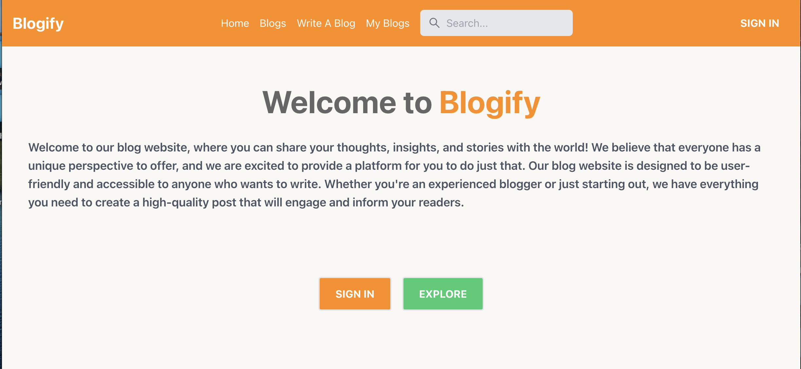

This is the frontend Code for the advanced blog application. It connects to a nodejs Backend and a mongoose database. users can post blogs and can edit later on. they can also comment on other blogs. Admin can edit all blogs and can even delete blogs.
The code For its backend using nodeJs,expressjs and MongoDb can be found on my repositories and it goes by the name blog-backend.

